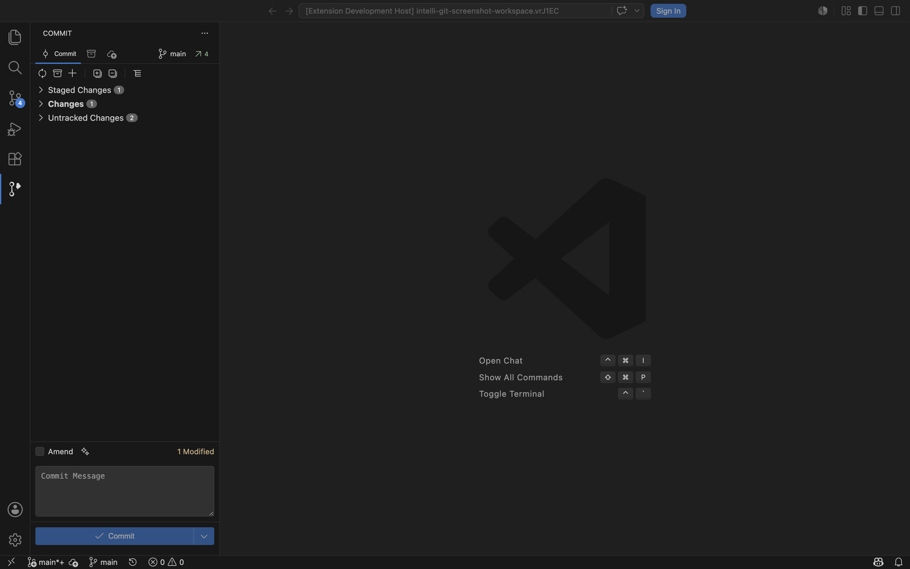
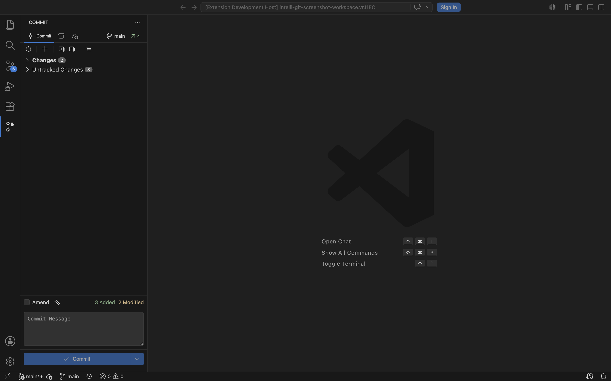
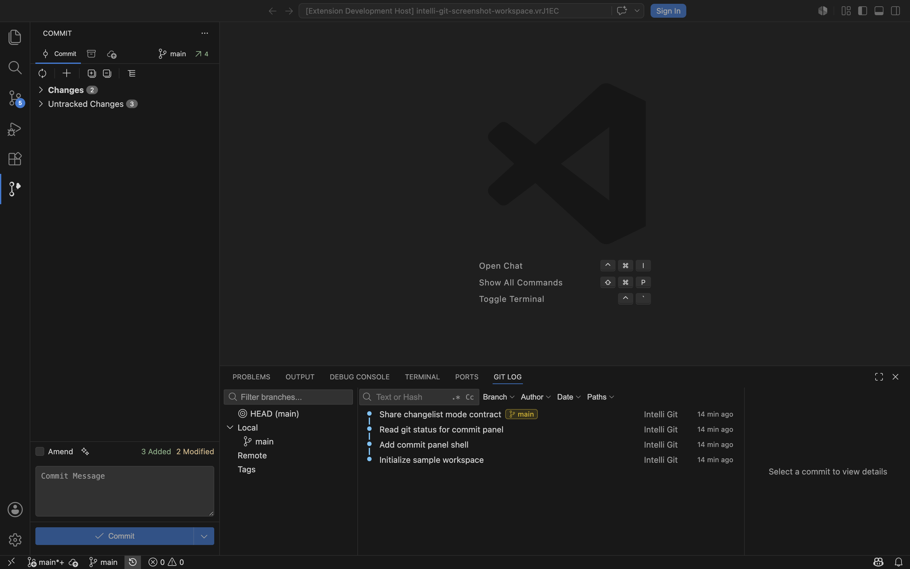

# Intelli Git

JetBrains-style Git workflows for Visual Studio Code.

Intelli Git adds a focused commit panel, changelists, Git Log, stash tools, push workflows, and AI-assisted commit message generation to VS Code without replacing the built-in Git extension. It is built for developers who regularly split local work into precise commits and need more structure than a flat source control list.

## Early Access

Intelli Git is currently free during Early Access.

## Screenshots

### Commit View In Staged Mode

Use the familiar Git index workflow with staged, unstaged, untracked, inactive, stash, push, and branch context in one side bar view.



### Commit View In Changes Mode

Use IntelliJ-style changelists when you want the active changelist to define what gets committed while other work stays visible but separate.



### Git Log

Browse history with branch filters, commit graph, commit metadata, and details actions from the VS Code panel.



## Features

- Commit panel with `staged` mode for the normal staged / unstaged Git model.
- `changes` mode with IntelliJ-style changelists and one active changelist.
- Inactive changes for keeping local work out of the current commit flow.
- Native VS Code context menus for files, folders, changelists, stash entries, branches, and commits.
- Git Log with branch filtering, commit graph, file history actions, cherry-pick, revert, reset, and commit message editing.
- Stash and push workflows from the Intelli Git UI.
- AI commit message generation with GitHub Copilot, Anthropic, Google AI, or a custom OpenAI-compatible endpoint.

## Commit Panel Modes

Intelli Git supports two commit panel modes through `intelli-git.changelist.mode`:

- `staged`: commits follow the Git index. Staged files define the commit selection and staging actions are available from the toolbar and file context menus.
- `changes`: commits use IntelliJ-style changelists. New tracked changes go into the active changelist, and commit execution only includes that active changelist.

Both modes keep the tree file-oriented. Changelist and file context menus use native VS Code webview context menus instead of custom DOM menus.

## AI And Privacy

Intelli Git runs locally inside VS Code and reads Git state from the workspace you open.

AI features are optional. When AI commit message generation is used, selected diff context may be sent to the configured AI provider. No AI request is made unless you invoke an AI action. API keys configured through Intelli Git are stored in VS Code SecretStorage.

## Requirements

- Visual Studio Code 1.100.0 or newer
- Git available on your system path
- A Git repository opened in VS Code

GitHub Copilot mode requires the GitHub Copilot extension. External AI providers require user-provided credentials.

## Development

### Prerequisites

- Node.js 22.13.0+ or 20.19.0+
- VS Code

### Install Dependencies

```bash
npm ci
```

### Build

```bash
# Full build (webview + extension TypeScript)
npm run compile

# Build webview only
npm run build:webview --workspace intelli-git

# Watch extension and webview builds together
npm run watch:extension

# Watch mode for webview UI
npm run watch --workspace webview-ui
```

### Quality Checks

```bash
npm run lint
npm run compile
npm run test
```

### Package

```bash
# Create a Marketplace-ready .vsix package
npm run package:extension

# Create an Open VSX-ready .vsix package
npm run package:extension:open-vsx

# Create a dev .vsix package
npm run package:extension:dev
```

### Publish

```bash
# Requires a Visual Studio Marketplace publisher and vsce login/PAT setup
npm run publish:extension:marketplace

# Requires OVSX_PAT for the Open VSX namespace
npm run publish:extension:open-vsx
```

For local Open VSX publishing on macOS, store the token in Keychain instead of
exporting it manually for every release:

```bash
read -s OVSX_TOKEN
security add-generic-password -a "$USER" -s intelli-git-ovsx-pat -w "$OVSX_TOKEN" -U
unset OVSX_TOKEN
```

Then publish with:

```bash
OVSX_PAT="$(security find-generic-password -a "$USER" -s intelli-git-ovsx-pat -w)" npm run publish:extension:open-vsx
```

In CI, provide the same value through an `OVSX_PAT` secret.

### Development Workflow

1. Run `npm run watch:extension`
2. Press `F5` in VS Code to launch the Extension Development Host
3. Make changes and reload the extension host to see updates

## License

Proprietary License - All rights reserved. See LICENSE file for details.
